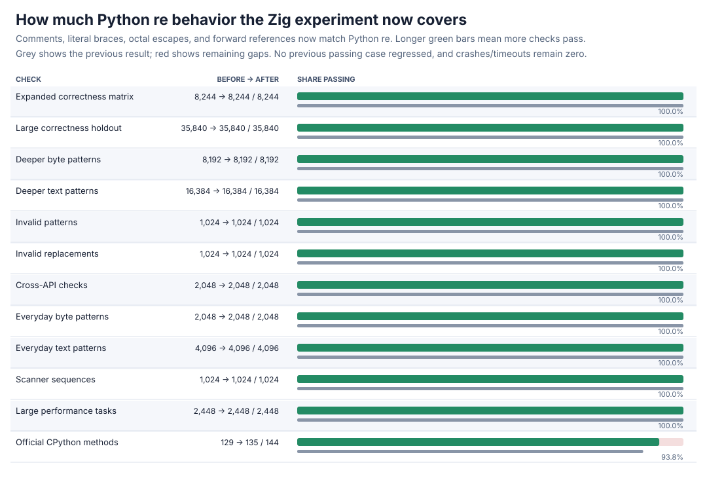
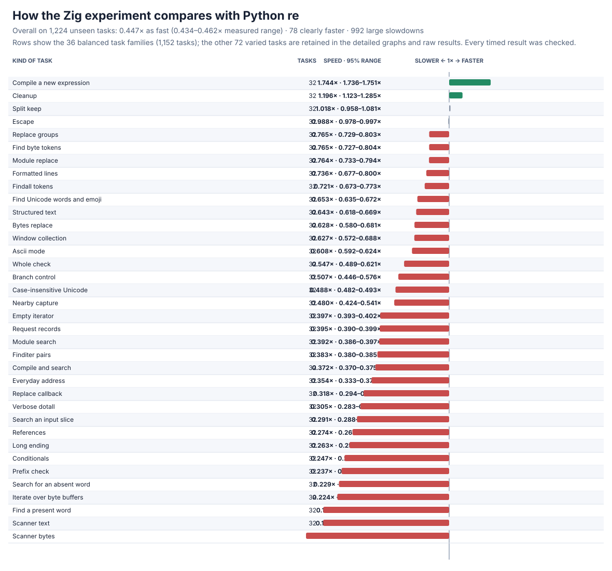
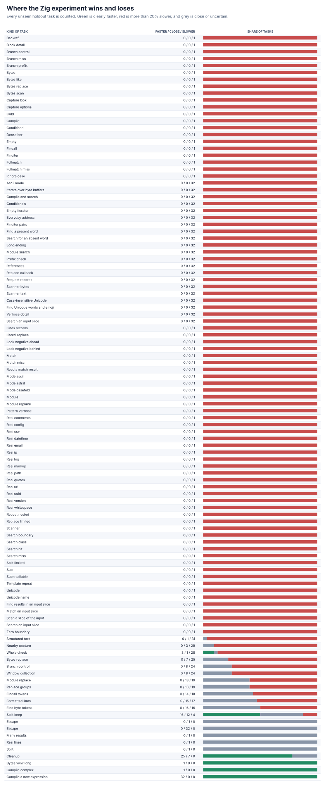

# Zig common-syntax follow-up

The from-scratch Zig parser now matches Python's common syntax edge cases: inline comments, braces that are ordinary text rather than repeats, octal escapes versus numbered references, and numeric references to a group defined later. It keeps all frozen correctness cases passing and removes six more official CPython failures.





## Headline result

| Frozen check | Before | After | New failures |
| --- | ---: | ---: | ---: |
| Expanded correctness matrix | 8,244/8,244 | **8,244/8,244** | 0 |
| Large correctness holdout | 35,840/35,840 | **35,840/35,840** | 0 |
| Large performance tasks | 2,448/2,448 | **2,448/2,448** | 0 |
| Official CPython methods | 129/144 | **135/144** | 0 |

The newly passing official methods cover historical regex cases, character and byte literals, lookahead conditionals, normal repeat syntax, and possessive repeat syntax. The remaining **nine** official failures are valid large-pattern, large-class, large-repeat, or many-group cases beyond the current compiler limits; none is a crash or timeout.

The full paired performance rerun covers **1,224 practice + 1,224 unseen holdout tasks**, frozen operation counts, 13 trials, memory, and **63,648** raw rows. Every result is checked before and after timing.

| Task set | Overall speed vs Python `re` | Clearly faster | Large slowdowns |
| --- | ---: | ---: | ---: |
| Practice | 0.419x (0.405--0.433x) | 74/1,224 | 1,024/1,224 |
| Holdout | **0.447x (0.434--0.462x)** | **78/1,224** | **992/1,224** |
| All | 0.433x (0.423--0.443x) | 152/2,448 | 2,016/2,448 |

Overall speed is close to the previous **0.443x** result and the measured ranges overlap. Cold compilation remains faster (**1.86x** for complex patterns and **1.74x** for long patterns); scanners (**0.15x**), references (**0.27x**), long cold search (**0.37x**), and short searches remain the main costs. The capture-returning core is **2.05x** overall on eight tasks, with seven faster and alternative search the sole loss. Every loss remains visible below and in the raw results.

## Correctness control and design

The new differential probe initially records **11,916** failures and now passes **18,168/18,168** comparisons: 31 fixed examples across every common API, all **256** byte values as three-digit octal escapes in both text and bytes with three suffix forms, and **16,384** seeded combinations of braces, comments, groups, conditionals, flags, and inputs. Existing nullable/long-repeat, lookbehind, error, scoped-flag, full-plane Unicode, span, and capture controls pass **16,589**, **16,528**, **18,298**, **16,552**, **8,781**, **8,874**, and **5,214** checks. Debug plus address/undefined-behavior checks pass all focused controls with zero findings.

Inline `(?#...)` comments are skipped during parsing and do not incorrectly become repeatable empty expressions. A brace is treated as a repeat only when its contents have Python's valid numeric shape; forms such as `x{}`, `x{a}`, and `x{2,a}` remain literal text, including after another repeat. Outside a character set, three octal digits beginning with `0`--`7` become a byte-valued literal, while a numbered reference consumes at most two decimal digits, so twelve groups followed by `\119` correctly means group 11 and a literal `9`. Numeric conditionals may point forward and are checked once the complete group count is known. All behavior is implemented in the local parser/executor; it does not call or wrap Python's matcher or an external regular-expression package.

## Detailed graphs




All legacy and generated task families appear in the detailed graphs. Process high-water marks, every confidence range, and every regression remain in the raw data; denominators are unchanged.

## Evidence and reproduction

Performance rows are [zig-syntax-v4-raw.jsonl.gz](zig-syntax-v4-raw.jsonl.gz), with the full summary in [zig-syntax-v4-summary.json](zig-syntax-v4-summary.json). Correctness results are [expanded](zig-syntax-v2-after.json.gz), [large holdout](zig-syntax-v3-after.json.gz), [performance qualification](zig-syntax-perf-v4-after.json), and [official](zig-syntax-upstream-after.json). Focused/safety evidence is [initial failures](zig-syntax-focused-before.json.gz), [focused](zig-syntax-focused.json), [nullable/long repeats](zig-syntax-nullable.json), [lookbehind](zig-syntax-lookbehind.json), [errors](zig-syntax-errors.json), [scoped](zig-syntax-flags.json), [Unicode](zig-syntax-unicode.json), [span](zig-syntax-span.json), [capture](zig-syntax-capture.json), [instrumented focused](zig-syntax-sanitized-focused.json), [instrumented nullable](zig-syntax-sanitized-nullable.json), [instrumented lookbehind](zig-syntax-sanitized-lookbehind.json), [instrumented errors](zig-syntax-sanitized-errors.json), [instrumented scoped](zig-syntax-sanitized-flags.json), [instrumented Unicode](zig-syntax-sanitized-unicode.json), [instrumented span](zig-syntax-sanitized-span.json), [instrumented capture](zig-syntax-sanitized-capture.json), [Zig delegation audit](zig-syntax-audit-zig.json), and [bridge delegation audit](zig-syntax-audit-bridge.json).

Reproduce with:

```sh
PY=/tmp/rebar-cpython/cpython-3.14.6-linux-x86_64-gnu/bin/python3.14
PYTHON="$PY" sh tools/build_zig_probe.sh
PYTHONPATH=. "$PY" tools/zig_syntax_probe.py --output /tmp/zig-syntax.json --seeded-cases 16384
PYTHONPATH=. "$PY" tools/perf_v4.py verify --module candidates.zig_candidate --output /tmp/zig-performance-check.json
PYTHONPATH=. "$PY" tools/zig_perf_v4_pilot.py --raw /tmp/zig-performance.jsonl --output /tmp/zig-performance.json --chart /tmp/zig-speed.svg --memory-chart /tmp/zig-memory.svg --regression-chart /tmp/zig-regressions.svg --trials 13 --bootstraps 5000
```

The new probe is [tools/zig_syntax_probe.py](../../tools/zig_syntax_probe.py). Static/import and linkage audits report zero forbidden markers or blocked attempts; production links only the local Zig engine and the C runtime.
