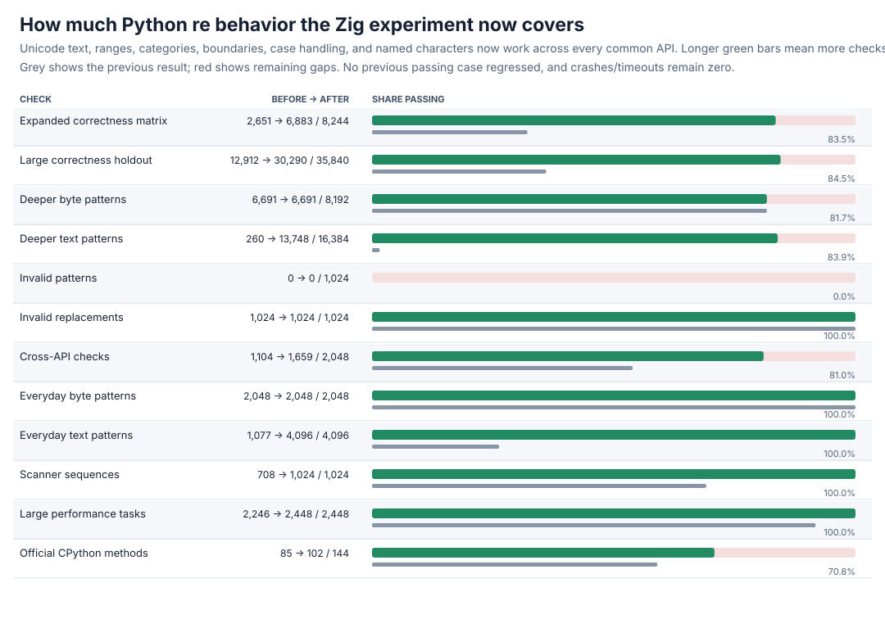
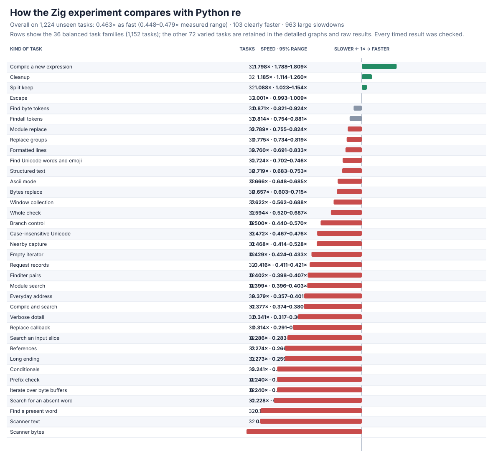
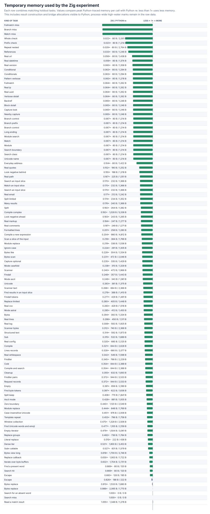
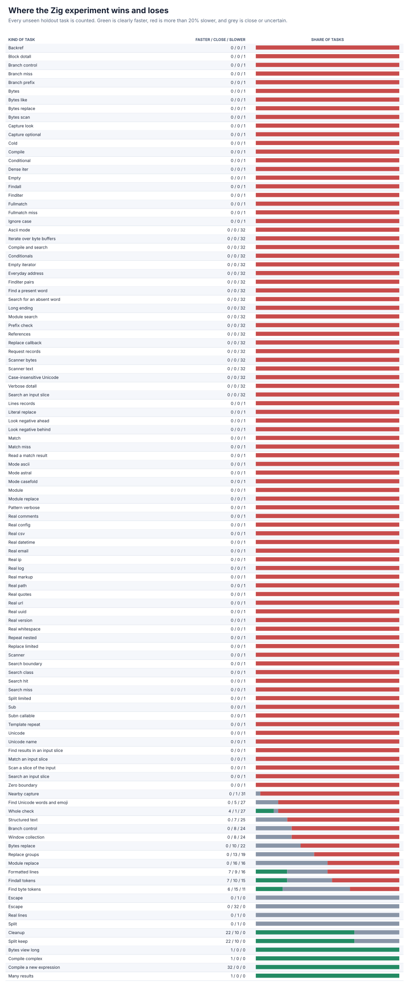

# Zig Unicode and large-holdout follow-up

The from-scratch Zig engine now handles ordinary Unicode text and patterns across the public API. It reads Python's compact text storage directly, keeps character-based indices, understands Unicode literals/ranges/categories/boundaries/case behavior/named characters, and qualifies **all 2,448 frozen large-performance tasks**. It does not wrap or call an external regular-expression engine.





## Headline result

The full, correctness-gated performance run contains **1,224 practice + 1,224 unseen holdout tasks**, 13 paired trials, the frozen operation counts and order seeds, peak/process memory, and **63,648** raw timing rows. Each task is checked before and after timing.

| Task set | Overall speed vs Python `re` | Clearly faster | Large slowdowns |
| --- | ---: | ---: | ---: |
| Practice | 0.442x (0.426--0.457x) | 99/1,224 | 990/1,224 |
| Holdout | **0.463x (0.448--0.479x)** | **103/1,224** | **963/1,224** |
| All | 0.452x (0.441--0.463x) | 202/2,448 | 1,953/2,448 |

`1x` means the same speed as Python `re`; higher is faster. Zig's cold compilation, some cleanup, splitting, and long-byte paths win. Scanners, short searches, and match-result construction remain the clearest losses. The graph groups the 36 balanced families so the overall picture is easy to read; the other 72 varied holdout tasks, all measured ranges, and every slowdown remain in the detailed results.

The smaller capture-returning core check remains **2.12x** overall on eight tasks (7 trials, 5,000 calls each): seven are clearly faster, while searching alternatives is 0.442x. This separates matching speed from the still-expensive public/result boundary.

## Compatibility gained

| Frozen check | Before | After | New failures |
| --- | ---: | ---: | ---: |
| Expanded correctness matrix | 2,651/8,244 | **6,883/8,244** | 0 |
| Large correctness holdout | 12,912/35,840 | **30,290/35,840** | 0 |
| Large performance tasks | 2,246/2,448 | **2,448/2,448** | 0 |
| Official CPython methods | 85/144 | **102/144** | 0 |

The large holdout now passes every everyday text/byte case, scanner sequence, and invalid-template case. Deeper text improves **260 to 13,748/16,384**; deeper bytes remain **6,691/8,192**; cross-API properties improve **1,104 to 1,659/2,048**. Invalid-pattern errors remain **0/1,024** because exact validation and error positions are a separate unfinished feature. All prior failure IDs are preserved in the compressed before/after evidence.

A new focused differential check covers:

- all **1,114,112** Unicode code points across 16 digit/space/word/negated/range/case patterns, including surrogate and astral values;
- **8,192** seeded calls across search, match, fullmatch, findall, finditer, split, replacement, and scanner paths;
- **333** special case-equivalence checks covering dotted/dotless I, long S, Kelvin sign, Greek/Cyrillic variants, ligatures, and related edge cases.

All **12,877** checks pass. Existing span and capture/reference gates pass **8,874/8,874** and **5,214/5,214**. Debug plus address/undefined-behavior checks pass the focused span/capture gates and **2,461** stratified Unicode checks with zero findings. The official suite has zero crashes/timeouts.

## Design

The parser and executor remain independently written. Text patterns are decoded as code points, while byte patterns keep byte semantics. Character classes retain a fast low-byte table plus explicit high ranges and category markers. The bridge passes Python's existing one-, two-, or four-byte text representation and its character length directly into Zig; it does not copy or UTF-8-rescan the subject, so windows, captures, and returned spans stay in Python character indices.

Unicode digit, whitespace, alphanumeric, and simple-case helpers are the same low-level character-data operations used by ordinary CPython extensions. They are the only new unresolved Python symbols in the Zig library. They do **not** parse, compile, or execute expressions and do not delegate to `re`, `_sre`, or an external package. Named characters are resolved once while compiling a text pattern. Byte and `ASCII` modes retain their distinct behavior.

The full-plane test caught three initial case errors: a multicharacter uppercase incorrectly admitted `ß` to `[A-Z]`, and the Angstrom sign was missing from two Latin ranges. Explicit simple-case/exception handling fixes all three. The final official run also confirms the previously failing Unicode set/range methods.

The current fixed program allocation grows from **283,544 B to 415,000 B** because wide instructions and class-range storage are still reserved up front. This is a measured memory regression and the next allocation target: compact compile-time arenas/finalized programs can remove unused nodes, code, and ranges. Executor stacks and unsupported large repeats also remain separate targets.

## Detailed graphs





The memory graph includes bridge/result allocations visible to Python; process-wide high-water marks are kept in the raw rows. Every legacy and generated task family appears in the detailed graphs, with no changed denominators.

## Evidence and reproduction

Raw performance rows are in [zig-unicode-v4-raw.jsonl.gz](zig-unicode-v4-raw.jsonl.gz); the complete task/family summary is [zig-unicode-v4-summary.json](zig-unicode-v4-summary.json). Correctness before/after evidence is [expanded before](zig-unicode-v2-before.json.gz), [expanded after](zig-unicode-v2-after.json.gz), [large holdout before](zig-unicode-v3-before.json.gz), [large holdout after](zig-unicode-v3-after.json.gz), [performance before](zig-unicode-perf-v4-before.json), [performance after](zig-unicode-perf-v4-after.json), [official before](zig-unicode-upstream-before.json), and [official after](zig-unicode-upstream-after.json). Focused/safety results are [Unicode](zig-unicode-focused.json), [span](zig-unicode-span.json), [capture](zig-unicode-capture.json), [instrumented Unicode](zig-unicode-sanitized.json), [instrumented span](zig-unicode-sanitized-span.json), and [instrumented capture](zig-unicode-sanitized-capture.json).

Reproduce the focused checks and the full paired run with:

```sh
PY=/tmp/rebar-cpython/cpython-3.14.6-linux-x86_64-gnu/bin/python3.14
PYTHON="$PY" sh tools/build_zig_probe.sh
PYTHONPATH=. "$PY" tools/zig_unicode_probe.py --output /tmp/zig-unicode.json --seeded-cases 8192
PYTHONPATH=. "$PY" tools/perf_v4.py verify --module candidates.zig_candidate --output /tmp/zig-performance-check.json
PYTHONPATH=. "$PY" tools/zig_perf_v4_pilot.py --raw /tmp/zig-performance.jsonl --output /tmp/zig-performance.json --chart /tmp/zig-speed.svg --memory-chart /tmp/zig-memory.svg --regression-chart /tmp/zig-regressions.svg --trials 13 --bootstraps 5000
```

The generators are [Unicode probe](../../tools/zig_unicode_probe.py), [correctness chart](../../tools/zig_unicode_chart.py), [large-holdout runner](../../tools/zig_perf_v4_pilot.py), and [chart regeneration](../../tools/zig_perf_v4_charts.py). Static/import and linkage audits report zero forbidden markers or blocked attempts; the native libraries link only the local Zig engine and C runtime.
