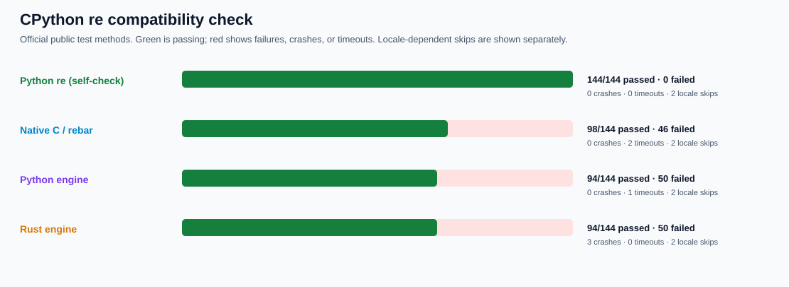
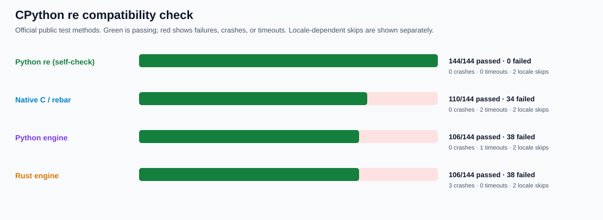
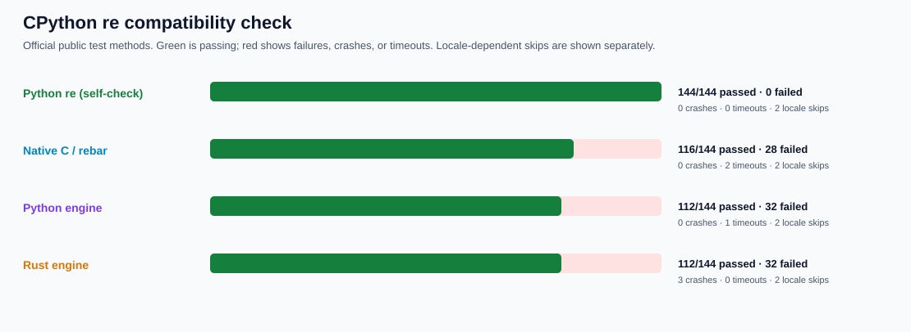
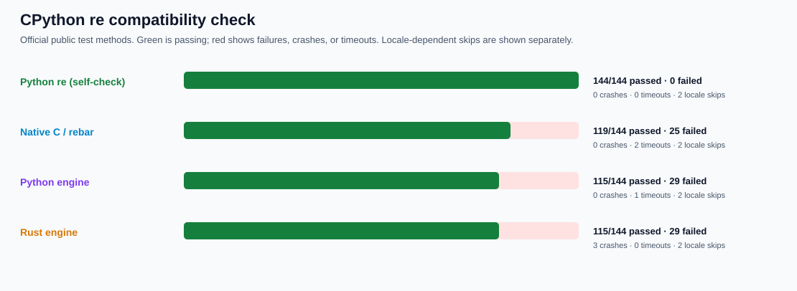

# Official CPython `re` compatibility oracle

This directory vendors the exact public `re` tests from the **CPython 3.14.6** source release. They are an additional, stricter gate for the claim that a Python `re` user can switch without changing behavior.

The source is the official `Python-3.14.6.tar.xz`, SHA-256 `143b1dddefaec3bd2e21e3b839b34a2b7fb9842272883c576420d605e9f30c63`. Vendored files and hashes are frozen in [manifest.json](manifest.json):

- `test_re.py`: `879c8b562a5bddb413e73ad6d026a6199785bd08fa1c2c5db1ef831b4e1c47e2`;
- `re_tests.py`: `ec04a2b2a77338d20b37d931693c7e588a2896d3c73c7b4b47973e24c13b5aab`;
- the upstream [LICENSE](LICENSE) is preserved unchanged.

The gate selects **146 public test methods**, including the upstream corpus of **403 patterns** (289 expected matches, 74 expected misses, 40 syntax errors) and **11 historical benchmark patterns** exercised at multiple offsets. Each method runs in an isolated process with a fixed timeout, so hangs and crashes are recorded as failures. Stdlib self-check passes **144/144 runnable methods**; two locale-specific methods are skipped because the required locale is not installed.

## Explicit waivers

Only the following tests are excluded, and the reason is fixed in the manifest:

- `PRIVATE-DEBUG-TEXT` and `PRIVATE-INTERNAL-COMPILER`: stdlib opcode dumps, `_sre`, `_compiler`, and deprecated implementation modules are not public behavior;
- `PRIVATE-CONSTANTS` and `PRIVATE-DEBUG-HOOK`: two tests import a private maximum-group constant or require a debug-build failure hook;
- `RESOURCE-BIGMEM`: two tests require multi-gigabyte resources;
- `ENV-MULTIPROCESSING`: the sandbox cannot create the forkserver socket used by one regression test;
- `PERFORMANCE-ASSERTION`: one timing threshold is covered by the versioned performance oracle instead of a correctness assertion.

No public semantic failure is waived.

## Initial results



| Engine | Runnable methods passed | Failed | Crashes | Timeouts |
| --- | ---: | ---: | ---: | ---: |
| CPython `re` self-check | **144/144** | **0** | **0** | **0** |
| Native C / `rebar` | 98/144 | 46 | 0 | 2 |
| Python engine | 94/144 | 50 | 0 | 1 |
| Rust engine | 94/144 | 50 | 3 | 0 |

The complete records are [stdlib](evidence/self.json), [native](evidence/rebar-initial.json), [Python](evidence/ast-initial.json), and [Rust](evidence/rust-initial.json). The failures expose real gaps missing from the earlier seeded oracle: arbitrary buffers and buffer locking, weak references, `re.Scanner`, Unicode case/range behavior, flag and error details, keyword handling, subclass normalization, overflow protection, and historical matching regressions. Native/Rust crashes and timeouts must be eliminated before further performance claims are accepted.

## Window and keyword follow-up


The broader performance oracle exposed missing windowed scanners and a native multiline backtracking error. Fixing those also makes the official `ReTests.test_keyword_parameters` method pass in every engine. Native compiled methods now accept documented keyword forms. Full reruns preserve all remaining failures and improve the counts by one method each:

| Engine | Runnable methods passed | Failed | Crashes | Timeouts |
| --- | ---: | ---: | ---: | ---: |
| CPython `re` self-check | **144/144** | **0** | **0** | **0** |
| Native C / `rebar` | 99/144 | 45 | 0 | 2 |
| Python engine | 95/144 | 49 | 0 | 1 |
| Rust engine | 95/144 | 49 | 3 | 0 |

The follow-up records are [native](evidence/rebar-window.json), [Python](evidence/ast-window.json), and [Rust](evidence/rust-window.json); the initial records above remain unchanged.

## Public API surface follow-up



The next compatibility cohort fixes canonical flag/pattern representations, unknown flags, immutable `groupindex`, weak references, `__index__` group arguments, duplicate-argument errors, and warning locations. Exactly 11 previously failing methods now pass in each engine, with no unrelated status changes:

| Engine | Runnable methods passed | Failed | Crashes | Timeouts |
| --- | ---: | ---: | ---: | ---: |
| CPython `re` self-check | **144/144** | **0** | **0** | **0** |
| Native C / `rebar` | 110/144 | 34 | 0 | 2 |
| Python engine | 106/144 | 38 | 0 | 1 |
| Rust engine | 106/144 | 38 | 3 | 0 |

The complete follow-up records are [native](evidence/rebar-surface.json), [Python](evidence/ast-surface.json), and [Rust](evidence/rust-surface.json). Earlier evidence remains unchanged.

## Inline and scoped flags follow-up



The next parser cohort fixes repeated global flags at the true start, scoped ASCII/Unicode/LOCALE switching, verbose spaces/comments and alternatives, incompatibility checks, and exact malformed-flag errors. Exactly six previously failing methods now pass in every engine, with no unrelated status changes:

| Engine | Runnable methods passed | Failed | Crashes | Timeouts |
| --- | ---: | ---: | ---: | ---: |
| CPython `re` self-check | **144/144** | **0** | **0** | **0** |
| Native C / `rebar` | 116/144 | 28 | 0 | 2 |
| Python engine | 112/144 | 32 | 0 | 1 |
| Rust engine | 112/144 | 32 | 3 | 0 |

The complete follow-up records are [native](evidence/rebar-flags.json), [Python](evidence/ast-flags.json), and [Rust](evidence/rust-flags.json). Earlier evidence remains unchanged.

## Unicode case-equivalence follow-up



The next executor cohort fixes case-insensitive literals, sets, and ranges: punctuation boundaries are preserved, ASCII/bytes remain ASCII-only, and CPython's special Unicode equivalence groups are handled correctly. Exactly three previously failing methods now pass in every engine, with no unrelated status changes:

| Engine | Runnable methods passed | Failed | Crashes | Timeouts |
| --- | ---: | ---: | ---: | ---: |
| CPython `re` self-check | **144/144** | **0** | **0** | **0** |
| Native C / `rebar` | 119/144 | 25 | 0 | 2 |
| Python engine | 115/144 | 29 | 0 | 1 |
| Rust engine | 115/144 | 29 | 3 | 0 |

The complete follow-up records are [native](evidence/rebar-unicode.json), [Python](evidence/ast-unicode.json), and [Rust](evidence/rust-unicode.json). Earlier evidence remains unchanged.

## Pattern and replacement escapes follow-up


The next parser/API cohort fixes three-digit octal escapes, invalid character-class escapes, partial hexadecimal errors, out-of-range Unicode escapes, named Unicode characters, replacement-string escapes, and replacement validation when the input is empty. Exactly seven previously failing methods now pass in every engine, with no unrelated status changes:

| Engine | Runnable methods passed | Failed | Crashes | Timeouts |
| --- | ---: | ---: | ---: | ---: |
| CPython `re` self-check | **144/144** | **0** | **0** | **0** |
| Native C / `rebar` | 126/144 | 18 | 0 | 2 |
| Python engine | 122/144 | 22 | 0 | 1 |
| Rust engine | 122/144 | 22 | 3 | 0 |

The complete follow-up records are [native](evidence/rebar-escapes.json), [Python](evidence/ast-escapes.json), and [Rust](evidence/rust-escapes.json). Earlier evidence remains unchanged.

Reproduce the frozen gate or one stable method ID:

```sh
PY=/tmp/rebar-cpython/cpython-3.14.6-linux-x86_64-gnu/bin/python3.14
PYTHONPATH=. "$PY" tools/cpython_re_oracle.py verify --module re
PYTHONPATH=. "$PY" tools/cpython_re_oracle.py verify --module rebar --test ReTests.test_keep_buffer
```
