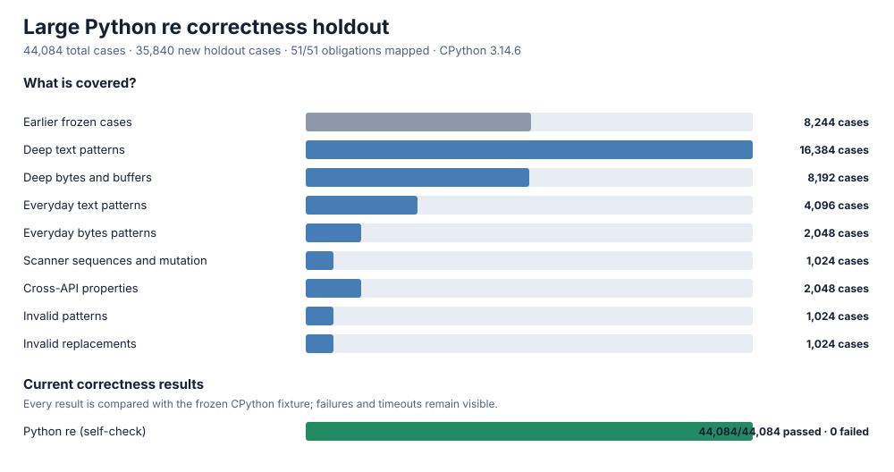

# Large correctness holdout v3

This version keeps every frozen v2 case byte-for-byte and adds **35,840 previously unused, deterministic holdout cases**, giving **44,084** cases in total. The oracle remains pinned to CPython **3.14.6**, Unicode 16.0.0, and the `C` locale. The holdout is kept separate from the earlier development matrix and its seeds, counts, runner, suite, and expected results are frozen together.

The frozen fixture SHA-256 is `782c41ff0b1239eeb0bb5312b4a893b41d7882c7fdcf64b29587518839e51669`; its v2 parent is `ae6a095bc0cd2b3ba1512a04f0d4fbe57916cf2d5b583fd4ecdda5c2c70a5bb2`. Stdlib self-check passes **44,084/44,084**, with **51/51** obligations mapped and zero unexplained failures.



## Coverage

| Holdout family | Cases | What it checks |
| --- | ---: | --- |
| Deep text | 16,384 | deeper combinations of captures, references, conditionals, lookaround, atomic/possessive/lazy repeats, boundaries, windows, flags, Unicode, and every public call |
| Deep bytes | 8,192 | the same public surfaces with bytes, bytearray, memoryview, high-byte input, ASCII/locale modes, and exact result types |
| Everyday text | 4,096 | logs, URLs, email, dates, versions, UUID/IP/path/configuration, comments, whitespace, markup, quotes/CSV, identifiers, numbers, tags, and Unicode noise |
| Everyday bytes | 2,048 | the everyday patterns with bytes-like inputs and non-ASCII byte noise |
| Scanner sequences | 1,024 | mixed `search`/`match`, windows, empty matches, captures, and observable buffer mutation between calls |
| Cross-API properties | 2,048 | module/compiled agreement, `findall` derived from `finditer`, windowed scanner agreement, replacement counts, and escape round trips |
| Invalid patterns | 1,024 | unseen malformed escapes, classes, repeats, groups, references, conditionals, lookbehind, and inline flags |
| Invalid templates | 1,024 | unseen malformed numbered/named references and replacement escapes across text/bytes and empty/no-match inputs |
| **New holdout** | **35,840** | **all new families** |
| Frozen v2 parent | 8,244 | all earlier directed, differential, property, error, warning, and public-contract cases |
| **Total** | **44,084** | **complete correctness matrix** |

Every new public-call family balances `search`, `match`, `fullmatch`, `findall`, `finditer`, `split`, `sub`, and `subn`, module and compiled surfaces, hits and misses, flags, windows, replacement forms, and text/bytes-like inputs. Stable IDs make any failure reproducible without changing the denominator.

New mapped obligations are `API-HOLDOUT`, `API-SCANNER-SEQUENCE`, `API-BUFFER-MUTATION`, `E-HOLDOUT`, `S-REAL-WORLD`, and `S-STRESS-HOLDOUT`; every earlier obligation remains mapped. Only the two existing named private waivers remain: `PRIVATE-CACHE-LAYOUT` and `PRIVATE-DEBUG-TEXT`. No public behavior is waived.

The CPython fixture is generated **twice** with a purge between runs and must agree byte-for-byte. The parent prefix must also exactly match the frozen v2 fixture. Each case has a fixed **1-second** guard so an accidental pathological expression is reported with its stable ID. The deep generator deliberately avoids ambiguous nested separator repeats that caused stdlib backtracking timeouts during preflight; realistic separator patterns remain covered directly. A candidate is qualified only with zero unexplained mismatches, crashes, or timeouts.

```sh
PY=/tmp/rebar-cpython/cpython-3.14.6-linux-x86_64-gnu/bin/python3.14
PYTHONPATH=. "$PY" tools/oracle_v3.py freeze
PYTHONPATH=. "$PY" tools/oracle_v3.py verify --module re --cohort holdout
PYTHONPATH=. "$PY" tools/oracle_v3.py verify --module rebar --cohort holdout
PYTHONPATH=. "$PY" tools/oracle_v3.py verify --module rebar --case v3.hold.real.text.00000
```
