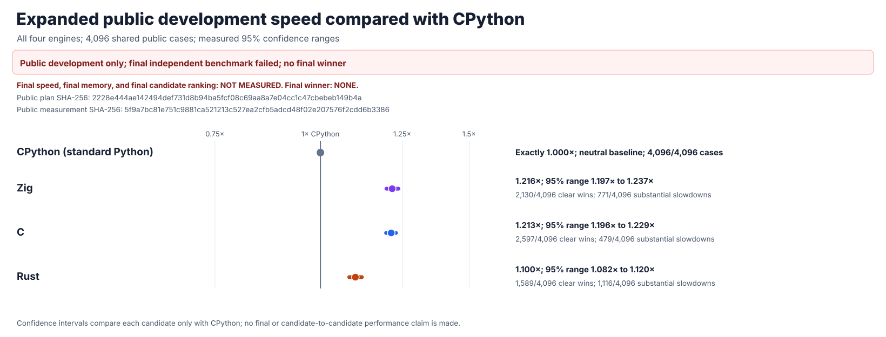

# Results: quote-aware Rust and 4,096 public regex cases

## Result

**No candidate reaches the required 1.5× overall speed.** The improved Rust
engine fixes its targeted quoted-split workload, but does not become a
generally faster Python `re` replacement. This is a separately frozen public
experiment, not a hidden final result or a final winner.

Python 3.14.6 and the three independently implemented regex engines received
exactly the same **4,096 public cases**, **13 shuffled paired trials**, and
**2,000** confidence resamples. All **638,976** Python-answer checks pass.

| Engine | Speed compared with Python | 95% uncertainty range | Clearly faster cases | More than 20% slower |
| --- | ---: | ---: | ---: | ---: |
| Zig | `1.216×` | `1.197–1.237×` | `2,130/4,096` | `771/4,096` |
| C | `1.213×` | `1.196–1.229×` | `2,597/4,096` | `479/4,096` |
| Rust | `1.100×` | `1.082–1.120×` | `1,589/4,096` | `1,116/4,096` |

C alone is clearly faster in at least 60% of cases, but still falls short of
1.5× overall. Zig and Rust satisfy neither complete success condition. Zig's
original hidden-test failure is also not repaired by a public speed result.

## What the Rust change actually improved

The Rust engine identifies quote-aware separators from its **own parsed
regular-expression syntax**. It counts quotes and finds separators using its
**own native matcher**, with no outside regex implementation.

In the same independently verified public run, all **54/54** quote-aware CSV
cases are statistically faster than Python. Their geometric-average speedup
is **11.205×**, with **zero** slowdowns. For one 1,992-character case,
Python takes `747,837 ns` and Rust takes `11,472.5 ns`; Rust's paired speedup
is `63.73×`, with confidence range `61.44–65.66×`.

The preserved
[previous public snapshot](../postfinal-public-v1/RESULTS.md) contained
**54/54** Rust slowdowns in that same named category. These are two
separately timed runs; no cross-run paired confidence interval is claimed.
The broad Rust result remains only **1.100×**, with **1,116** substantial
slowdowns, so the optimization is a documented targeted improvement, not a
qualified overall winner.

## All measured slowdowns

Every denominator is fixed. Every entry below counts cases where a candidate
was more than 20% slower than standard Python.

| Operation | C | Zig | Rust |
| --- | ---: | ---: | ---: |
| Compile | 0 | 0 | 0 |
| Escape | 0 | 0 | 0 |
| Find all matches | 156 | 92 | 205 |
| Iterate matches | 76 | 127 | 120 |
| Full match | 65 | 165 | 185 |
| Match | 0 | 151 | 130 |
| Match-object behavior | 11 | 10 | 51 |
| Scanner | 83 | 57 | 145 |
| Search | 87 | 150 | 167 |
| Split | 0 | 1 | 64 |
| Replace | 1 | 16 | 46 |
| Replace and count | 0 | 2 | 3 |
| Total | **479** | **771** | **1,116** |

The [full regression chart](evidence/postfinal-public-practice-v2-regressions.svg)
individually identifies **all 2,366** substantial slowdowns. Rust remains
weakest on finding every match, full-string matches, searching, scanners, and
short matches. Per-case cycle attribution is **NOT MEASURED**; these workload
counts are not presented as a profile.

## What was frozen and verified

The [protocol](PROTOCOL.md), complete public-case manifest, four engine
fingerprints, **76-control from-scratch audit**, original compatibility
proofs, exact case weights, all trial and confidence seeds, and predetermined
chart verifier were committed and pushed before timing. The final
pre-measurement commit was
`397a0e4bf267130b39c79e32cd1aa8badbe4e52a`.

- **4,096** equally weighted public cases and **260** workload categories.
- All **12** Python regular-expression operations.
- **212,992** compressed raw timing observations.
- **638,976** exact correctness checks.
- **12,291** independently recalculated confidence intervals.
- All **three** independent candidate engines and **five** native libraries.
- All **2,366** measured slowdowns.
- **83,968** additional exact Rust quote-pattern checks.
- **Zero** hidden cases opened, generated, or decoded.

The complete, independently hashed evidence is:

- [Frozen public manifest](manifest.json):
  `2228e444ae142494def731d8b94ba5fcf08c69aa8a7e04cc1c47cbebeb149b4a`.
- [All compressed raw observations](evidence/postfinal-public-practice-v2-raw.jsonl.gz):
  `144e7d1fca42f258f004d5ea972d336620a42d8371911a69a93550f687cceb05`.
- [Complete measured results](evidence/postfinal-public-practice-v2-summary.json):
  `5f9a7bc81e751c9881ca521213c527ea2cfb5adcd48f02e207576f2cdd6b3386`.
- [Independent, candidate-free replay](evidence/postfinal-public-practice-v2-integrity.json):
  `1f5ff0ed42cb2aef76cffb6e056c040f208d9e83ded117dcd957ee33faa31489`.
- [Independent quote-pattern correctness](../../candidates/evidence/rust-postfinal-quote-parity-stage-02-oracle.json):
  `882f64f47a1150496689f7e6894bdb11021fb6162fbf89b30948de9e648d9680`.

The other predefined graphs show
[all wins and losses](evidence/postfinal-public-practice-v2-outcomes.svg),
[every operation and workload](evidence/postfinal-public-practice-v2-api.svg),
[all substantial slowdowns](evidence/postfinal-public-practice-v2-regressions.svg),
[Python-visible temporary allocations](evidence/postfinal-public-practice-v2-memory.svg),
and [overall public rankings](evidence/postfinal-public-practice-v2-rankings.svg).

Python-visible allocations are not native-engine memory or isolated
whole-process memory; both remain **NOT MEASURED**. The original one-time
hidden final remains **FALSIFIED**, with final speed, final confidence, final
memory, and a final winner **NOT MEASURED**.
