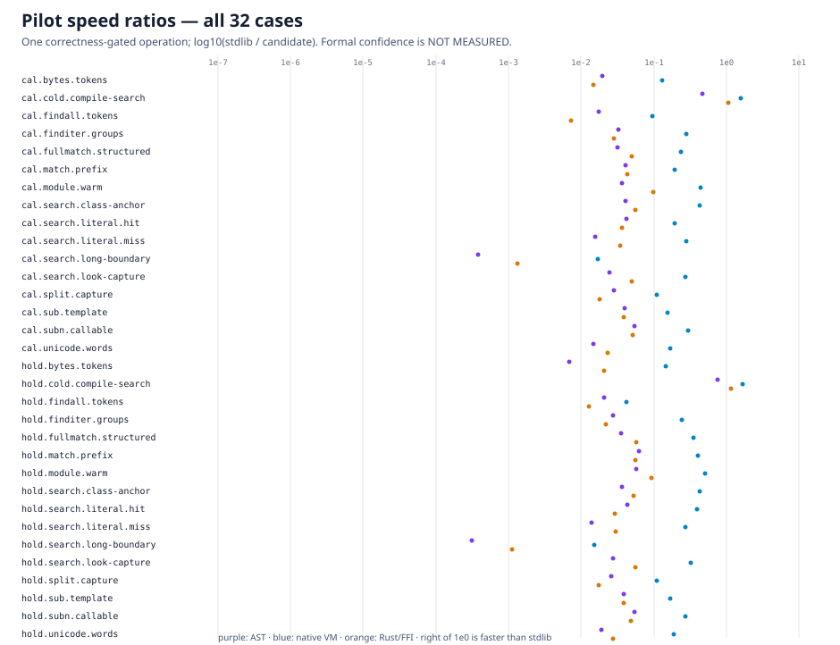

# Native-search experiment

The first pilot showed that both native candidates crossed the Python/native boundary once per possible start position. Both engines already expose an in-engine search mode. Their public search/find-iterator paths now pass the complete subject once and let the native executor scan starts; this is a general production change with no pattern, benchmark, or holdout detection.

All 2,048 correctness cases pass for each changed candidate, all 128 performance correctness checks pass, and the repeated pilot preserves every row in [pilot-native-search.jsonl](pilot-native-search.jsonl), SHA-256 `75173aa5c322a1331c369fc024689cdb3bdd70660751471fd604490210f324d2`. This is a one-operation diagnostic; formal confidence remains **NOT MEASURED**.

The measured boundary improvement is material:

| Case | VM before | VM after | Rust before | Rust after |
| --- | ---: | ---: | ---: | ---: |
| `cal.search.long-boundary` | 1.786 ms | 0.185 ms | 8,647.261 ms | 2.346 ms |
| `hold.search.long-boundary` | 2.667 ms | 0.264 ms | 19,535.678 ms | 3.603 ms |

The Rust path improves by roughly 3,700x and 5,400x in these observations and the VM by roughly 10x. Both remain slower than stdlib on this workload; the losses are retained. The full frozen paired protocol is now practical without changing cases, weights, seeds, operation counts, or denominators.

