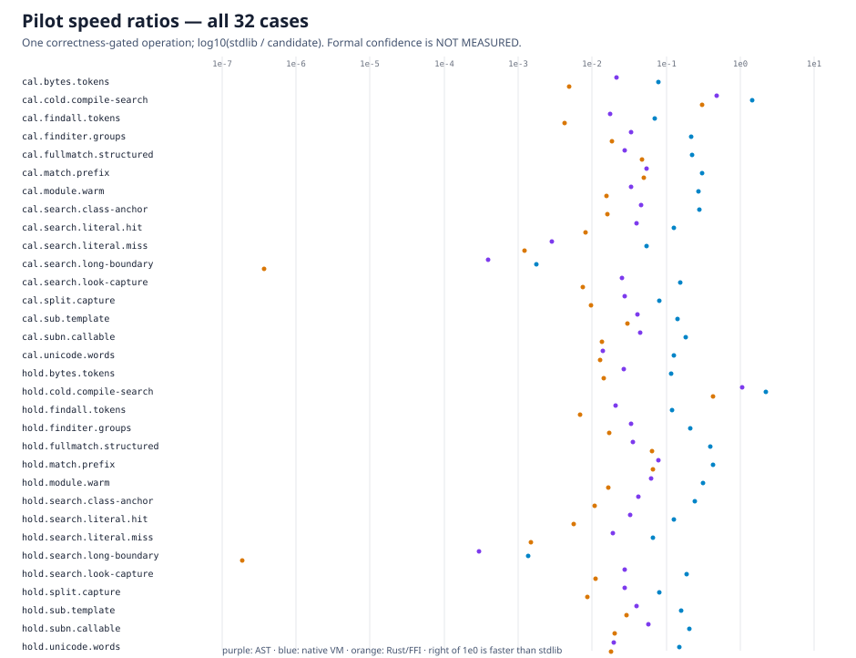

# Performance pilot: one correctness-gated operation per case

This is a diagnostic experiment, not the paired performance result. It executes all 32 frozen cases for all four modules once, validates the complete result before and after the timed operation, and preserves all 128 raw observations in [pilot.jsonl](pilot.jsonl), SHA-256 `745c2bd5a9c94e568e3ae87b52cd00d7140e0ea301c176b87d07a57861181492`. Confidence intervals and formal rankings are **NOT MEASURED**.

The pilot falsifies any early speed claim: the native VM is usually several times slower than stdlib end-to-end, the Python AST is slower again, and the Rust FFI candidate is dominated by boundary preparation/search. Cold compile/search is the one category where the VM is competitive in this single observation; that is not a statistical claim.

The most important measured defect is the long-boundary search path:

| Case | stdlib | AST | native VM | Rust/FFI |
| --- | ---: | ---: | ---: | ---: |
| `cal.search.long-boundary` | 0.003 ms | 7.995 ms | 1.786 ms | 8,647.261 ms |
| `hold.search.long-boundary` | 0.004 ms | 12.299 ms | 2.667 ms | 19,535.678 ms |

Rust's public wrapper repeatedly prepares and crosses the FFI for every possible start position even though the Rust engine already exposes a native search mode. This produces a measured quadratic boundary cost. Running the frozen operation counts unchanged would spend roughly 2.6 hours on those two Rust timed batches alone, before warmups/correctness checks. The evidence supports fixing that production path for all inputs, then rerunning both oracles and the complete paired protocol. No holdout pattern is special-cased.

