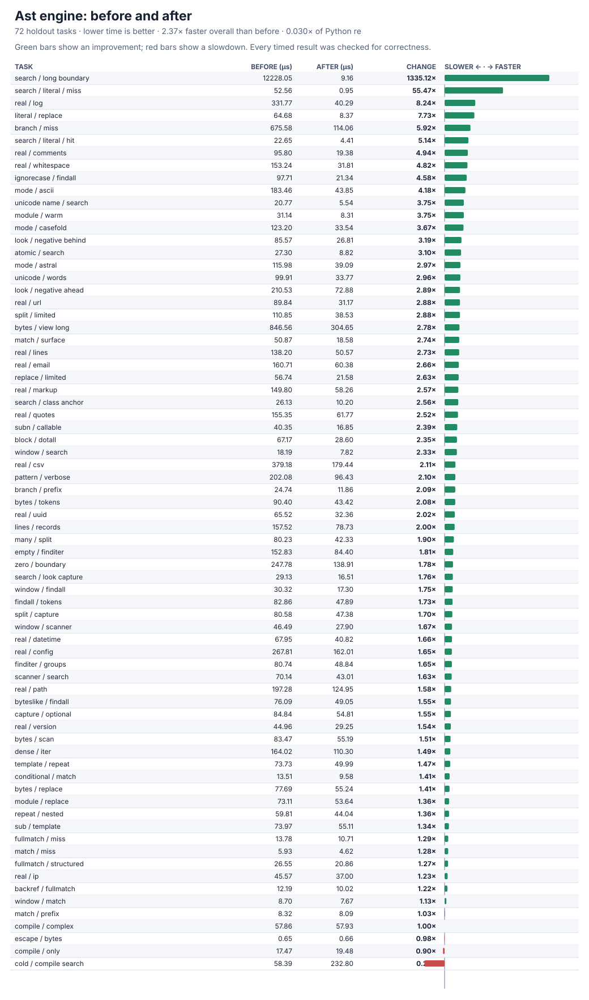

# Python engine optimization result

The from-scratch Python engine is now **2.37× faster overall than its initial version** across all 72 holdout tasks. It reaches **0.0303×** of CPython `re`; it remains much slower than the native winner on ordinary matching calls. This is a five-trial iteration pilot, not a replacement for the frozen full benchmark. Every one of its **864** pre/post-timing comparisons passes.



The largest improvements address measured executor and per-character overhead, not individual benchmark answers:

- A safe literal-start hint skips directly to possible matches; a conservative, lazy 256-character start table rejects impossible ASCII/byte starts for classes and alternatives while leaving other Unicode characters to the full matcher.
- Search validates and constructs its executor once, immutable-input iteration reuses it, and repeat layouts/tables are cached safely by their originating AST node. Mutable buffers continue to be read on each iteration.
- Literal runs, repeated classes/categories, flag checks, and collection result construction avoid thousands of short-lived generators, enum operations, and public-accessor calls while preserving ordered backtracking and captures.

Representative paired results (lower time is better):

| Holdout task | Before | After | Improvement |
| --- | ---: | ---: | ---: |
| Find a long final marker | 12,228.05 µs | **9.16 µs** | **1,335.12×** |
| Find an absent word | 52.56 µs | **0.95 µs** | **55.47×** |
| Read request logs | 331.77 µs | **40.29 µs** | **8.24×** |
| Search absent alternatives | 675.58 µs | **114.06 µs** | **5.92×** |
| Find a present word | 22.65 µs | **4.41 µs** | **5.14×** |
| Clean whitespace | 153.24 µs | **31.81 µs** | **4.82×** |
| Exclude prefixed words | 210.53 µs | **72.88 µs** | **2.89×** |
| Find many byte-buffer values | 846.56 µs | **304.65 µs** | **2.78×** |
| Find email-like addresses | 160.71 µs | **60.38 µs** | **2.66×** |
| Split quoted fields | 379.18 µs | **179.44 µs** | **2.11×** |

All tasks, including losses, remain in [python-engine-pilot.json](python-engine-pilot.json), SHA-256 `dfce2445a0f1a4e0986008a70369839ee0feb104696be42712a4cc60d4ca11c4`; the generated chart SHA-256 is `780dac83e91800f602bc22f28b488295058098df05d6526c31672a6d3207d2c3`. The [initial pilot](engine-pilot-before.json) is retained unchanged.

The expanded 8,244-case matrix, all 144 runnable official CPython methods, all 66,033 focused differential checks, performance correctness, and delegation audit pass with zero failures, crashes, timeouts, or forbidden imports. Reproduce:

```sh
PY=/tmp/rebar-cpython/cpython-3.14.6-linux-x86_64-gnu/bin/python3.14
PYTHONPATH=. "$PY" tools/oracle_v2.py verify --module candidates.ast_candidate
PYTHONPATH=. "$PY" tools/cpython_re_oracle.py verify --module candidates.ast_candidate
PYTHONPATH=. "$PY" tools/perf_v3.py verify --module candidates.ast_candidate
PYTHONPATH=. "$PY" tools/engine_pilot.py --output /tmp/python-engine-pilot.json --module candidates.ast_candidate
PYTHONPATH=. "$PY" tools/engine_pilot_chart.py --before performance/v3/evidence/engine-pilot-before.json --after /tmp/python-engine-pilot.json --module candidates.ast_candidate --output /tmp/python-engine-pilot.svg
```
