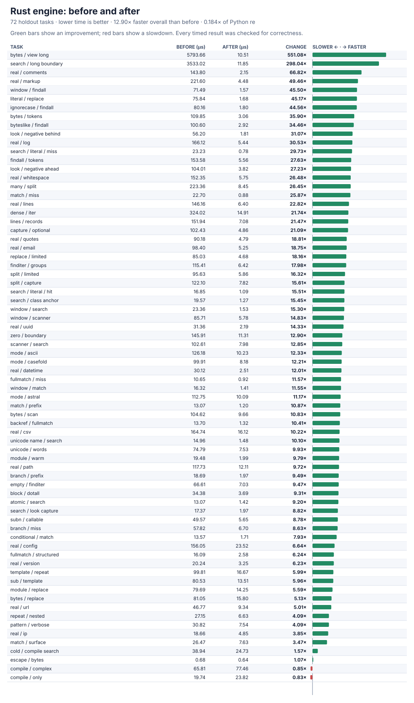

# Rust engine optimization result

The independent, from-scratch Rust engine is now **12.90× faster overall than its initial version** across all 72 holdout tasks. It reaches **0.1845×** of CPython `re`; it remains slower than the native winner on ordinary matching calls. This is a five-trial iteration pilot, not a replacement for the frozen full benchmark. Every one of its **864** pre/post-timing comparisons passes.



The improvements target measured boundary, allocation, and repeated-work costs broadly:

- The dependency-free CPython bridge passes ASCII strings and contiguous byte buffers directly to Rust, prepares non-ASCII case/category data natively, constructs result spans without `ctypes`, and batches `findall`, splitting, and non-callback replacement. Its loader uses `$ORIGIN`, so the candidate imports correctly from outside the repository.
- Rust now keeps byte inputs as borrowed views, skips impossible ASCII starts, uses compact class tables, advances deterministic sequence atoms in place, and avoids repeat-expression cloning and boxed repeat iterators. Unicode and ambiguous starts remain conservative.
- Literal replacement and validated replacement templates avoid repeated parsing and match-object work. Mutable buffers and callbacks retain their observable behavior.

Representative paired results (lower time is better):

| Holdout task | Before | After | Improvement |
| --- | ---: | ---: | ---: |
| Find many byte-buffer values | 5,793.66 µs | **10.51 µs** | **551.08×** |
| Find a long final marker | 3,533.02 µs | **11.85 µs** | **298.04×** |
| Replace a literal word | 75.84 µs | **1.68 µs** | **45.17×** |
| Find mixed-case words | 80.16 µs | **1.80 µs** | **44.56×** |
| Read request logs | 166.12 µs | **5.44 µs** | **30.53×** |
| Find an absent word | 23.23 µs | **0.78 µs** | **29.73×** |
| Find text tokens | 153.58 µs | **5.56 µs** | **27.63×** |
| Exclude prefixed words | 104.01 µs | **3.82 µs** | **27.23×** |
| Clean whitespace | 152.35 µs | **5.75 µs** | **26.48×** |
| Find email-like addresses | 98.40 µs | **5.25 µs** | **18.75×** |

The final rows are [rust-engine-pilot.json](rust-engine-pilot.json), SHA-256 `8a317d5216866a3aaee4daab1be4b7f9f24e094bb8e91e799e17454b4cfb6ec6`; chart SHA-256 is `ef63b9eb2f4d770f717deb8ade4c722c6afc2deb844038e9ea4ea06911383e97`. Every slowdown remains visible.

An inline eight-capture representation was also tested. It removes small allocations, but copies larger state values and produces mixed results: its contemporaneous pilot falls from **0.1473×** to **0.1465×** of stdlib. It is rejected. The [control](rust-inline-control.json), [inline result](rust-inline-rejected.json), and their [control chart](rust-inline-control.svg)/[inline chart](rust-inline-rejected.svg) are preserved.

## Correctness and safety

The expanded 8,244-case matrix, all 144 runnable official CPython methods, all 66,033 focused differential checks, performance correctness, and delegation audits of both Rust and bridge source pass with zero failures, crashes, timeouts, or forbidden engine imports. Overflow/debug-assertion builds and an AddressSanitizer/UndefinedBehaviorSanitizer bridge plus instrumented Rust build pass the expanded suite, every performance case, long-input controls, and collection controls. The bridge links only the local Rust engine and system libraries.

Reproduce the optimized build and pilot:

```sh
PY=/tmp/rebar-cpython/cpython-3.14.6-linux-x86_64-gnu/bin/python3.14
PYTHON="$PY" RUSTFLAGS='-D warnings' sh tools/build_rust.sh
PYTHONPATH=. "$PY" tools/oracle_v2.py verify --module candidates.rust_candidate
PYTHONPATH=. "$PY" tools/cpython_re_oracle.py verify --module candidates.rust_candidate
PYTHONPATH=. "$PY" tools/perf_v3.py verify --module candidates.rust_candidate
PYTHONPATH=. "$PY" tools/audit_candidate.py candidates/rust_candidate.py candidates.rust_candidate candidates/rust/src/lib.rs
PYTHONPATH=. "$PY" tools/audit_candidate.py candidates/rust_candidate.py candidates.rust_candidate candidates/rust/py_bridge.c
PYTHONPATH=. "$PY" tools/engine_pilot.py --output /tmp/rust-engine-pilot.json --module candidates.rust_candidate
PYTHONPATH=. "$PY" tools/engine_pilot_chart.py --before performance/v3/evidence/engine-pilot-before.json --after /tmp/rust-engine-pilot.json --module candidates.rust_candidate --output /tmp/rust-engine-pilot.svg
```
