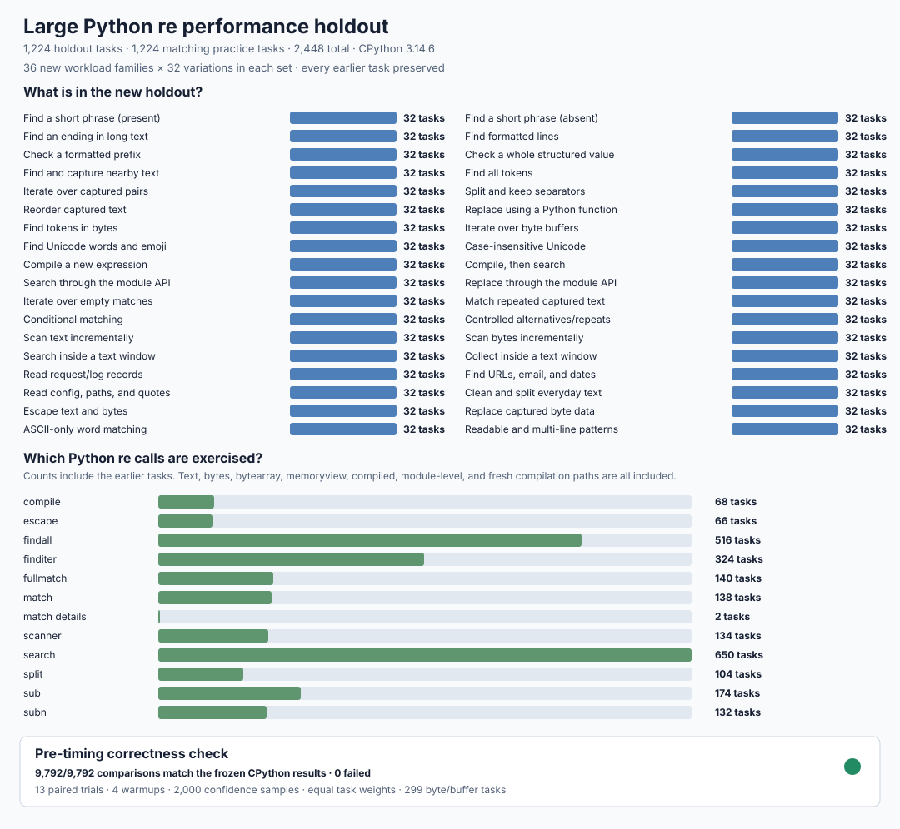

# Large performance holdout v4

This version expands the performance comparison to **1,224 holdout tasks** and **1,224 matching practice tasks**. The first **144** records are byte-for-byte identical to the earlier fixture; the remaining **2,304** tasks add **36** everyday workload families with **32** deterministic variations in each set. Every task has weight 1, so the holdout denominator is always **1,224**.

The baseline is the pinned, unmodified CPython **3.14.6** `re` module. The three independently implemented engines are compared under the same conditions. The fixture is generated twice with stdlib and must agree exactly; it is also pinned to the **44,084-case** correctness oracle. Fixture SHA-256: `cccb7372b724975bea2de63edfbcd559522384d2d1ea57b8d2a07a32cd36f906`.



## What is tested

The new holdout covers short phrases that are present or absent, long endings, formatted lines, prefix and whole-value checks, nearby captures, token/pair collection, splitting, group and callback replacement, bytes and mutable buffers, Unicode/emoji/case handling, fresh compilation, cached module calls, empty matches, references, conditionals, controlled branches/repeats, scanners, windows, logs/requests, URLs/email/dates, configuration/paths/quoted text, cleanup, escaping, ASCII mode, and readable/multi-line patterns.

Inputs vary independently between the practice and holdout sets using stable seeds (`1983072911` and `1983072929`). Each family includes short and longer inputs, hits and misses where meaningful, different result counts, and a mix of text, bytes, bytearray, and memoryview. The exact patterns, inputs, flags, operation counts, weights, and stable IDs are in [suite.py](suite.py).

Across all **2,448** tasks there are **650** `search`, **138** `match`, **140** `fullmatch`, **516** `findall`, **324** `finditer`, **104** `split`, **174** `sub`, **132** `subn`, **134** scanner, **68** compile, **66** escape, and two detailed-match tasks. Lifecycles include **2,116** compiled calls, **198** module-level calls, and **134** fresh compilations/searches; **299** tasks use bytes or byte buffers.

## How timings are kept honest

Every engine result is compared with the frozen stdlib output immediately **before every timed trial** and the final result is checked again **after every timed batch**. A mismatch, crash, or exception stops measurement. Nothing incorrect is timed or included in the summary.

- **13 paired trials** and **4 untimed warmups** for every task and engine.
- Engine order is shuffled deterministically for each task/trial with seed `1983072901`.
- Garbage collection is disabled only for the timed batch and restored immediately afterward. Time uses `perf_counter_ns`.
- Every raw row records task, engine, trial, order, operation count, elapsed time, traced Python peak memory, process RSS/high-water observations, and the expected-result digest, including Python/native boundary costs.
- A complete run contains exactly **127,296 raw rows** (2,448 tasks × 4 engines × 13 trials). Missing, duplicate, incorrect, or mismatched rows fail analysis.

## How results are summarized

Each task compares paired times as `Python re time / engine time`: **1× means the same speed; higher is faster**. Measured ranges use **2,000** deterministic bootstrap samples with seed `1983072902`. Overall speed combines every task with equal weight using the geometric mean. An engine is clearly faster only when the lower end of the measured 95% range is above 1×. Every result below 0.8× is kept and reported as a large slowdown.

The success threshold remains: at least **1.5× overall on holdout**, clearly faster on at least **60%** of holdout tasks, zero unexplained correctness failures/crashes/undefined behavior, and an explanation for every slowdown greater than 20%.

## Pre-timing correctness check

The fixture is deterministic, preserves all earlier records, and passes stdlib-vs-stdlib. The pre-timing check of stdlib and all three engines completes **9,792/9,792** comparisons with zero failures; the complete result is [initial-correctness.json](evidence/initial-correctness.json). **Performance is NOT MEASURED in this freeze chunk.**

```sh
PY=/tmp/rebar-cpython/cpython-3.14.6-linux-x86_64-gnu/bin/python3.14
PYTHONPATH=. "$PY" tools/perf_v4.py freeze
head -n 144 performance/v4/expected.jsonl | cmp performance/v3/expected.jsonl -
PYTHONPATH=. "$PY" tools/perf_v4.py verify --output /tmp/v4-correctness.json
```
