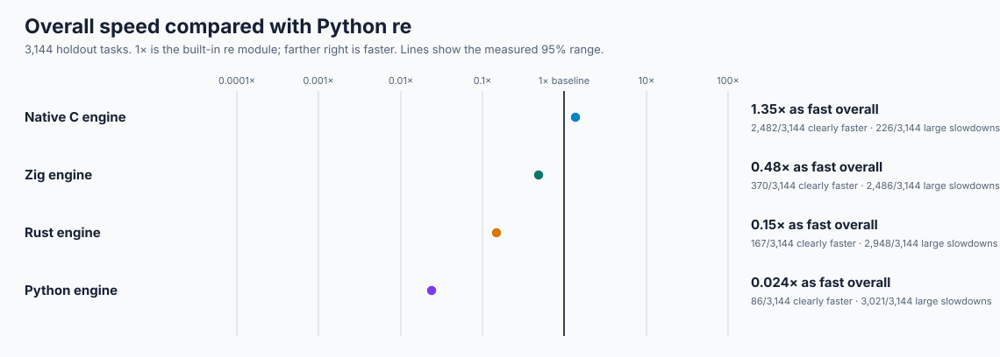
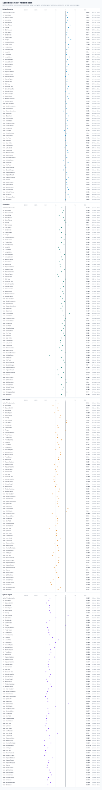
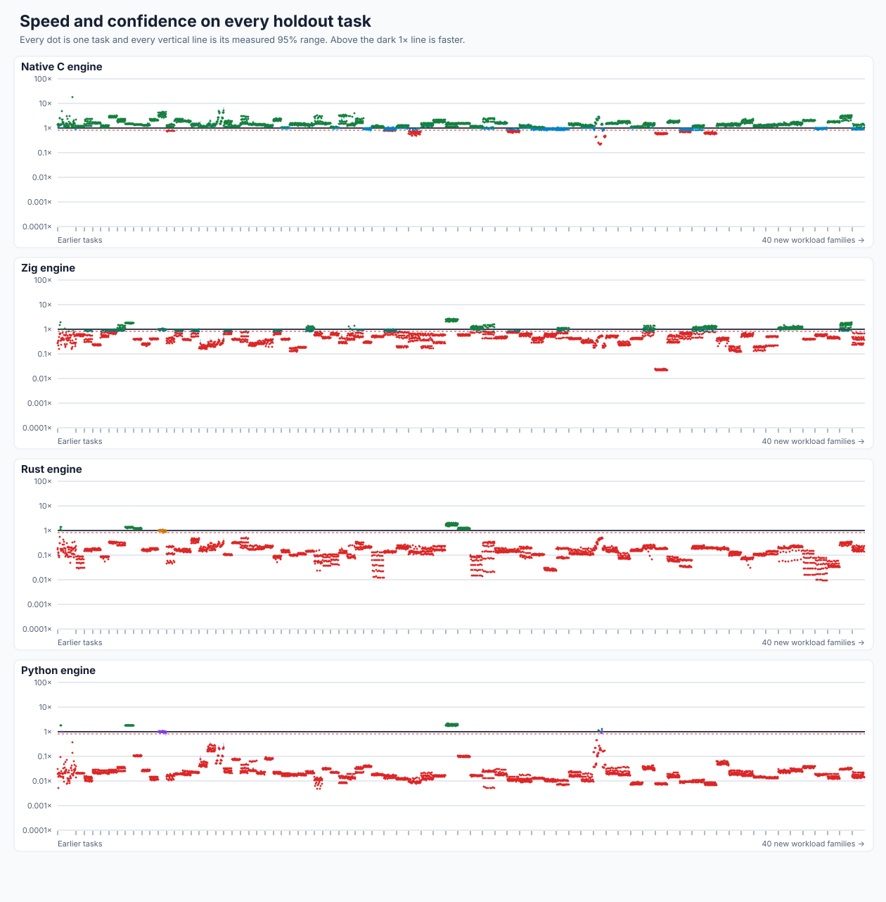
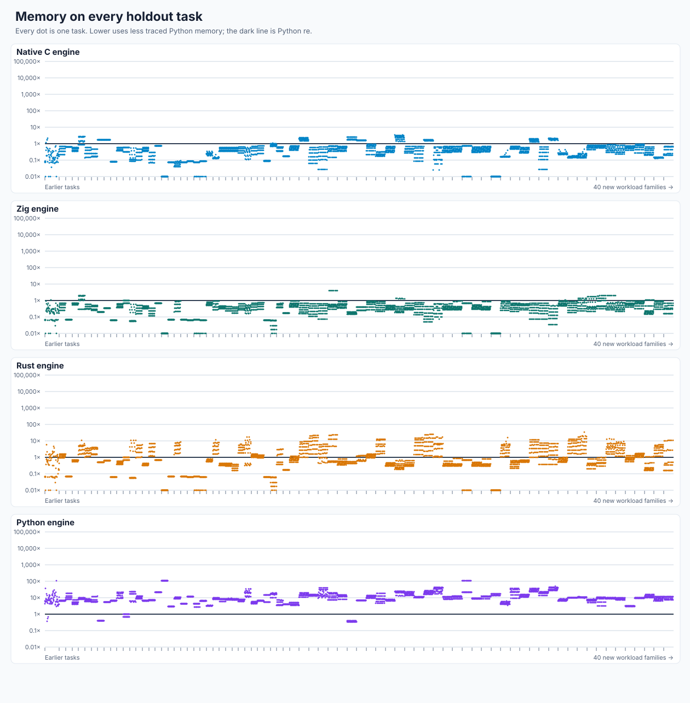
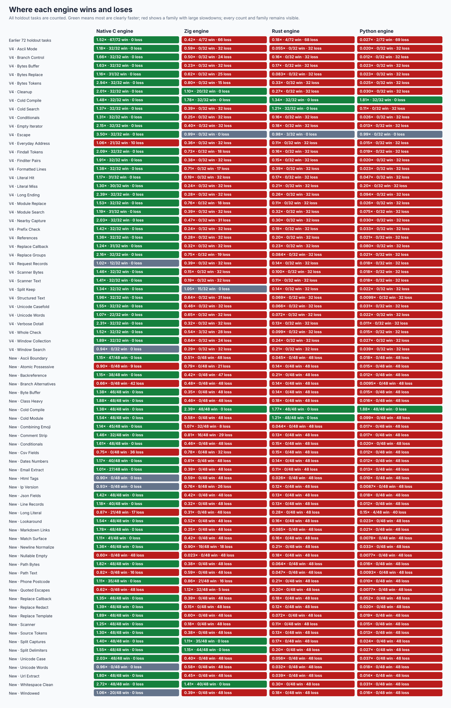
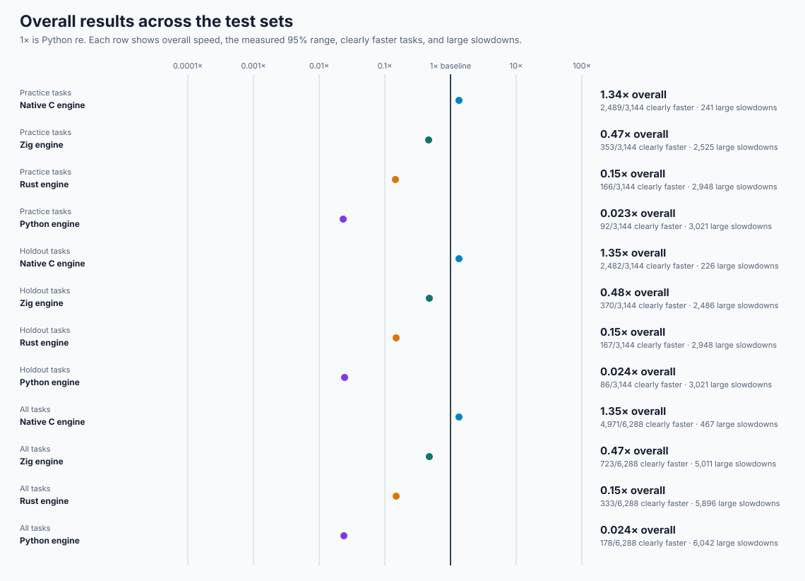

# Expanded performance holdout: initial result notes

The larger unseen set changes the conclusion. Native C is still the fastest from-scratch engine and is clearly faster on **2,482/3,144 (79%)** tasks, but its **1.3507x** overall speed is below the experiment's **1.5x** target. The **226** large holdout slowdowns are retained and explained below. Zig improves its relative position on the new workloads but remains well behind Python `re`; Rust and Python remain slower across most tasks.

| Engine | Holdout speed | Measured 95% range | Clearly faster | Large slowdowns |
| --- | ---: | ---: | ---: | ---: |
| Native C / `rebar` | **1.3507x** | 1.3494--1.3520x | **2,482/3,144** | **226/3,144** |
| Zig | 0.4807x | 0.4802--0.4811x | 370/3,144 | 2,486/3,144 |
| Rust | 0.1492x | 0.1491--0.1493x | 167/3,144 | 2,948/3,144 |
| Python | 0.0241x | 0.0241--0.0241x | 86/3,144 | 3,021/3,144 |

The preserved **1,224-task** portion is consistent with the earlier result: native C reaches **1.563x**, Zig **0.450x**, Rust **0.180x**, and Python **0.033x**. On the **1,920 new unseen tasks** alone the results are native C **1.231x**, Zig **0.502x**, Rust **0.132x**, and Python **0.020x**. This is the purpose of the expansion: it reveals costs that a smaller holdout understated, without changing old records or weights.

## What causes the native C losses?

All **226** large holdout slowdowns fall into eight families. The counter-enabled native engine checks each result against CPython before and after profiling; the linked profiles retain every case and count.

| Family | Large losses | Family speed | What the counters show |
| --- | ---: | ---: | --- |
| Empty/nullable matches | 48/48 | 0.597x | **137** general calls, **1,178** state copies, **1,376** class checks, and **5,829** matcher steps per call on average; safe progress and many empty results dominate. |
| Quoted/escaped text | 48/48 | 0.619x | **342** state copies and **882** steps per call; escaped-character alternatives repeatedly backtrack. |
| Many word alternatives | 42/48 | 0.664x | No general states, but about **304** direct matcher steps per call; repeatedly choosing among words is costly. |
| Quoted/plain CSV fields | 36/48 | 0.752x | **377** state copies and **1,039** steps per call; quoted/plain choices and captures dominate. |
| Long literal scans | 17/48 | 0.870x | The direct literal path performs no bytecode steps; these losses are scanning/call overhead, especially on absent or long inputs. |
| Text paths | 16/48 | 0.821x | **80** state copies and **203** repeated-character checks per call; optional roots and repeated path segments backtrack. |
| Controlled repeats | 9/48 | 0.901x | **63** state copies and **160** repeated-character checks per call; atomic/possessive alternatives use general state on slower cases. |
| Earlier email-like collection | 10/32 | 1.062x | Repeated character and class checks remain on the compact path; these are the same multi-result losses seen in v4. |

Profiles are [empty/nullable](native-expanded-nullable-empty-profile.json), [quoted text](native-expanded-quoted-escapes-profile.json), [alternatives](native-expanded-branch-alternatives-profile.json), [CSV](native-expanded-csv-fields-profile.json), [long literals](native-expanded-long-literal-profile.json), [paths](native-expanded-path-text-profile.json), [controlled repeats](native-expanded-atomic-possessive-profile.json), and [earlier address/email](native-large-everyday-address-profile.json). Every remaining practice loss and task ID is in the [complete report](INITIAL.md).

## Where the other engines spend time

Zig's best families are fresh compilation (**2.39x**), whitespace cleanup (**1.41x**), and splitting (**1.11--1.15x**). Its largest losses are empty/nullable iteration (**0.023x**), redaction (**0.150x**), scanners (**0.178x**), short calls, references, and captured/multi-result workloads. Its from-scratch matcher is fast when returning simple spans, but Python/native crossings, repeated match construction, capture restoration, and the fixed compiled-program allocation remain visible end-to-end.

Rust also wins fresh compilation/module calls (**1.21--1.77x**) but loses heavily on nested classes, Unicode, structured paths/URLs, templates, and collection. Python wins compilation but most matching and result construction remains interpreter-bound. All **17,416** practice/holdout slowdowns, their stable IDs, measured ranges, and memory ratios are in the [complete report](INITIAL.md); none is hidden or removed.

## Detailed graphs and evidence

The [complete paired rows](initial-raw.jsonl.gz) contain exactly **408,720** records; decompressed SHA-256 is `c905fa024c5ee6990cf4af7145af9a06432e9f22667e434c728e571de6334308`. The [full summary](initial-summary.json) retains **25,152** candidate/task results and **17,416** large slowdowns. The independent [post-run correctness gate](final-correctness.json) passes **31,440/31,440** comparisons. Final frozen/upstream evidence is retained for [native C/rebar](final-rebar-v3.json), [Python](final-ast_candidate-v3.json), [Rust](final-rust_candidate-v3.json), and [Zig](final-zig_candidate-v3.json), plus their matching `final-*-v2.json` and `final-*-upstream.json` files; all four pass **44,084/44,084**, the first three pass **144/144** official methods, and Zig remains **135/144** with zero crashes/timeouts. The profiler is [tools/native_v5_profile.py](../../../tools/native_v5_profile.py); the chart and complete-report generators are [tools/performance_v5_charts.py](../../../tools/performance_v5_charts.py) and [tools/performance_v5_report.py](../../../tools/performance_v5_report.py).
